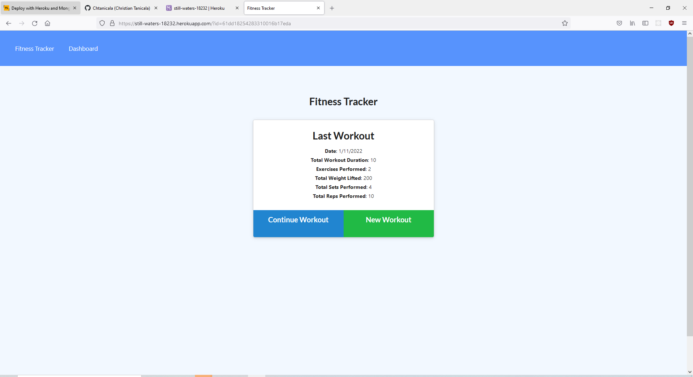
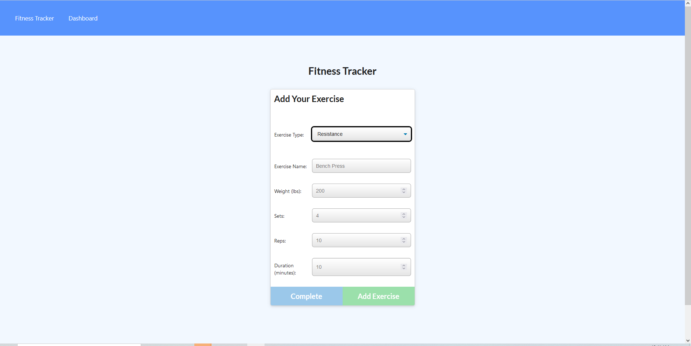

# Workout-Tracker

## Table of Contents
- [Description](#Description)
- [Usage](#Usage)
- [Contributing](#Contributing)
- [Links](#Links)
- [Screenshots](#Screenshots)
- [Questions](#Questions)
    
## Description
- Thuis application allows one to track their different types of workouts such as resisstance and cardio, as well as compare the statistics of said workouts over time.
    

## Usage
- Click add new workout, then input the relevant information, once done you may click complete, or add workout.
- Click on the fitness tracker in order to view relevant data and statistics

## Contributing
- Christian Tanicala

## Links
- https://still-waters-18232.herokuapp.com (Deployed)
- https://github.com/Chtanicala/Workout-Tracker (Repository)

## Screenshots
- 
- 
- 

    
## Questions
- Contact username, Chtanicala, on Github
- Email christian.tanicala@gmail.com